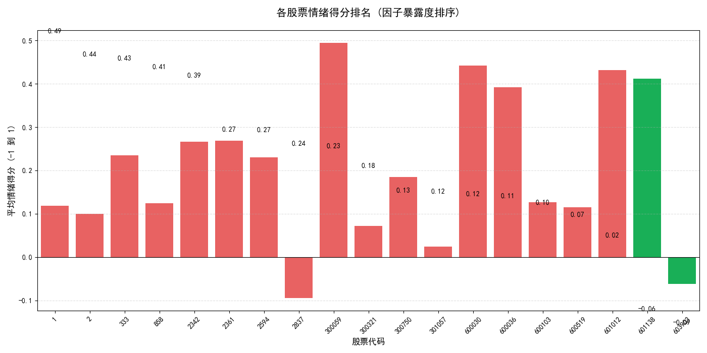
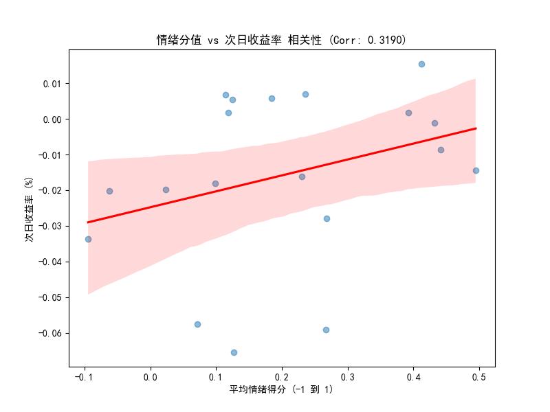

# FinSentinel: Chinese Financial NLP Pipeline & Cross-Sectional Alpha Exploration

FinSentinel is an end-to-end natural language processing pipeline designed to extract actionable quantitative signals from Chinese financial news. Unlike typical projects that rely on public datasets, this pipeline introduces a novel data construction method using **DeepSeek-V3 (via API)** for automated zero-shot annotation. It features a comprehensive benchmark comparing traditional machine learning (TF-IDF + Logistic Regression) against deep learning (Chinese FinBERT).

Furthermore, the project extends beyond NLP metrics by conducting a cross-sectional analysis on A-share stocks, validating the efficacy of FinBERT-derived sentiment scores as potential Alpha factors (Pearson $r = 0.3190$) for predicting T+1 stock returns.

---

## 📊 Performance Summary

### Model Benchmark Results
| Model | Accuracy | Macro F1 | Latency (ms/sent) |
| :--- | :---: | :---: | :---: |
| **TF-IDF + Logistic Regression** | 0.4990 | 0.4096 | **0.08** |
| **HKUST-FinBERT (Local)** | **0.6803** | **0.6807** | 32.49 |

### Quantitative Signal Validation


*Cross-sectional sentiment factor exposure ranking (Factor Intensity).*


*Pearson correlation analysis between aggregated sentiment scores and T+1 stock returns.*

---

## 🚀 Key Features

- **Industrial Grade Dashboard**: Real-time monitoring of data crawling and LLM labeling using `rich` library.
- **Automated Dataset Construction**: Seamlessly merge distributed CSV files and use LLMs for automated sentiment labeling.
- **FinBERT Inference**: Local deployment of HKUST-FinBERT for high-precision financial sentiment analysis.
- **Quantitative Integration**: Automated A-share ticker matching (SS/SZ) and T+1 return correlation analysis via `yfinance`.
- **Factor Ranking**: Cross-sectional sentiment factor exposure ranking for asset selection.

---

## 🛠️ Installation & Setup

1. **Clone the repository**
   ```bash
   git clone https://github.com/yourusername/FinSentinel.git
   cd FinSentinel
   ```

2. **Install dependencies**
   ```bash
   pip install -r requirements.txt
   ```

3. **Configure API Key**
   Set your DeepSeek API key as an environment variable:
   ```bash
   export DEEPSEEK_API_KEY="your_api_key_here"
   ```

---

## 📂 Project Structure

- `project-1/`: Core functional scripts (Crawler, Labeler, Signal Analysis).
- `data/`: Raw news data collected from Eastmoney Guba.
- `analysis_reports/`: Generated reports, distribution charts, and benchmark results.
- `finbert_local/`: (Optional) Local directory for FinBERT model weights.

---

## 📝 Roadmap

1.  **Crawler**: Daily automated scraping of stock news.
2.  **Merger**: Data cleaning and deduplication.
3.  **Labeler**: LLM-assisted zero-shot sentiment annotation.
4.  **Benchmark**: Evaluates model performance on the custom dataset.
5.  **Strategy**: Correlation analysis and Factor Ranking.

---

## ⚖️ Disclaimer
*This project is for educational and research purposes only. The signals generated do not constitute financial advice. Past performance is not indicative of future results.*

---

## 📚 Acknowledgements & References

This project is built upon the shoulders of the open-source community. Special thanks to the following institutions and creators:

* **Chinese FinBERT Model**: The sentiment analysis engine utilizes the `finbert-tone-chinese` model developed by the **Hong Kong University of Science and Technology (HKUST)** FinNLP team. 
  * Hugging Face Repository: [yiyanghkust/finbert-tone-chinese](https://huggingface.co/yiyanghkust)
  * Reference Paper: *Huang, Allen H., Hui Wang, and Yi Yang. "FinBERT: A Large Language Model for Extracting Information from Financial Text." Contemporary Accounting Research (2022).*
* **Zero-Shot Annotation**: The automated dataset construction was powered by **DeepSeek-V3** via its open API.
* **Financial Data**: Historical A-share market data was retrieved using the `yfinance` library.
